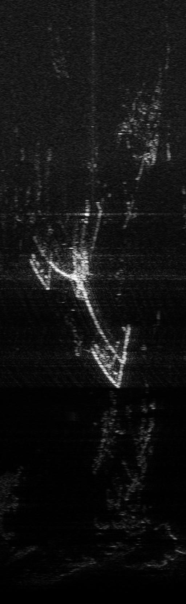
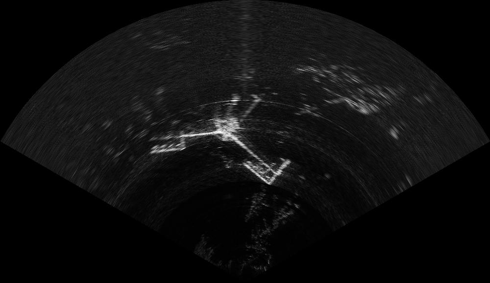

# Reading Tritech and ARIS data files with Python

A comprehensive library was developed to read Tritech data files as part of the PAMGuard Tritech plugin module. Tritech files are fairly complex, having records that have been compressed with the zip utility written to a .dat file which is then zipped again into a .glf file.

For ease of use in PAMGuard we needed to be able to randomly access any record in and file in large folders of files over extended time periods. Unzipping each glf file and then searching for a record would simply be too slow.

We therefore developed a cataloging system whereby each file is analysed the first time is is opened whereby the basic information about each record and it's start byte in the .dat file (the file inside the glf zip file) is stored in an index file .glfx alongside each glf file.

We then wrote our own zip reader which makes a catalog of byte offsets of the zipped up .dat file within the glf file.

This allowed us to make a reader which can a) very rapidly load summary information on many records over an extended time period and b) rapidly access any record and load it's full data in a matter of milliseconds.

The system works with Tritech glf and ecd files and ARIS data files.

The most simple way to use this cataloging system is to generate a [MultiFileCatalog](https://douggillespie.github.io/TritechFiles/tritechgemini/fileio/MultiFileCatalog.html) and to tell it which folder (with optional sub folders) to search for sonar files. You can then step through the records sequentially, or use functions such as findRecordForTime(sonarId, timeMillis) to get a record for a particular sonar as close as possible to the given time.

The Java functions can be called from Matlab or from Python and can easily return the raw data from each record, or a converted fan image.

The Python example in this folder is in the form of a Jupiter Notebook that was written and tested using VS Code using both glf and ARIS data files.

Full Java documentation on the library is available at <https://douggillespie.github.io/TritechFiles/tritechgemini/fileio/package-summary.html>

## Fan image creation

Conversion of the rectangular image data to a fan image requires a number of transforms to map from the beam/distance data to an x,y grid. To speed this up, the code uses a system of lookup tables that tell each point in the generated xy grid where to take data from the raw data. This is all handled in the Java object [FanPicksFromData](https://douggillespie.github.io/TritechFiles/tritechgemini/imagedata/FanPicksFromData.html). The constructor is passed either 1,2 or 4 telling it how many adjacent points in the raw data to use in each output point and will use a weighted average of up to four raw data points to generate a value for each point in the xy grid. An example of usage is in the accompanying Python notebook.

Raw data image

Fan data image

## Detectors and background subtraction

The basic detectors used by PAMGuard are also included in this library within the [tritechgemini.detect package](https://douggillespie.github.io/TritechFiles/tritechgemini/detect/package-summary.html). These have been sucessfully called from Matlab, so we expect they would work when called from Python.
